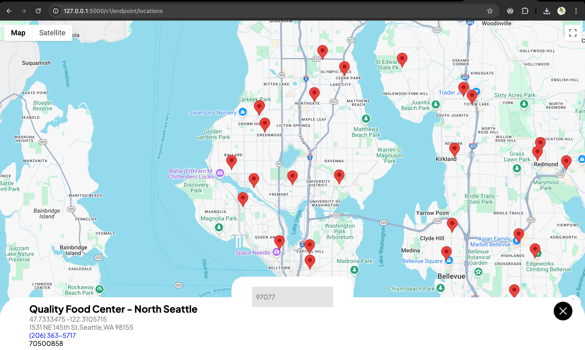

# Store Locator + Inventory Viewer

This project leverages the Kroger API to help users locate nearby stores, complete with address and contact details. Store locations are rendered on an interactive map using Google Maps, providing a clear spatial overview.

## Key Features Overview

| Category                 | Capabilities                                              | Benefits for Users                         | Developer Applications                          |
|--------------------------|-----------------------------------------------------------|---------------------------------------------|--------------------------------------------------|
| **Store Discovery**       | Find nearby Kroger stores with full contact info          | Easy access to store details                | Geolocation services, local availability tools   |
| **Map Visualization**     | Render store locations on Google Maps                     | Intuitive, location-based exploration        | Embeddable map modules                          |
| **Inventory Access**      | Query real-time product inventory per store               | Check stock before visiting                 | Inventory dashboards, alert systems             |
| **Product Filtering**     | Sort and filter by price, category, availability          | Faster product discovery                     | Custom search interfaces                        |
| **Modular API Layer**     | Built as an extensible backend                            | N/A                                          | Integration into third-party applications       |
| **Data-Driven Design**    | Clean separation of data, view, and logic                 | Smooth and fast user experience             | Scalable foundation for future features         |
| **Seamless Delivery API** | Integrate with full-service delivery partners             | Delivery options at checkout                | Support for third-party logistics and shipping  |
| **Unattended Locker Pickup** | Enable pickup via unattended smart lockers              | Flexible pickup experience                  | Locker system integrations                      |
| **Cart API (Public)**     | Add items to a logged-in customer's cart programmatically | Quick add-to-cart flows                     | Shopping apps, recommendation engines           |

## Table of Contents
- [Installation](#installation)
- [Setup Virtual Environment](#setup-virtual-environment)
- [Running the Project](#running-the-project)
- [Contributing](#contributing)
- [License](#license)
- [License](#Heroku)




## Installation

Follow these steps to get the project up and running on your local machine:

### Clone the repository
Open your terminal and run the following command:
```bash
git clone git@bitbucket.org:seymourrbrts/oath2.git 
```
## Setup Virtual Environment 

Follow these steps to get the python virtual environment setup
```bash 
python -m venv venv
```

### 1. Activate the Virtual Environment
You need to make sure the virtual environment is activated before you run the following commands. 

- On macOS/Linux:
	```bash
	source venv/bin/activate
	```
	On Windows: 
	```bash
	.\venv\Scripts\activate
	```
Make sure that your terminal shows the name of the virtual environment (venv) at the start of the shell prompt. 

### 2. Install Dependencies 
Once the virtual environment is install is activated, run the following command to install all dependencies listed in the `requirements.txt` file. 

```bash
pip install -r requirements.txt
```
Verify all the dependencies are installed 
```bash
pip freeze
```
This will show the list of packages that were installed. Check to make sure they match with the `requirements.txt` file contents if there are any issues. 

## Node Modules Setup (Node + Pug)

This project uses [Pug](https://pugjs.org/) for HTML templating. To compile the templates and work on the frontend, follow these steps:

### 1. Install Node.js Dependencies

Make sure you have [Node.js](https://nodejs.org/) installed (v14+ recommended).

Then run the following in the project root to install dependencies from *package.json*:

```bash
npm install
```
## Running the Project
## Flask Development Cheat Sheet

### Project Setup

| Command | Description | Example |
|---------|-------------|---------|
| `python -m venv venv` | Create virtual environment | `python -m venv venv` |
| `source venv/bin/activate` | Activate virtual env (Linux/Mac) | `source venv/bin/activate` |
| `.\venv\Scripts\activate` | Activate virtual env (Windows) | `.\venv\Scripts\activate` |
| `pip install flask` | Install Flask | `pip install flask==3.0.0` |
| `pip freeze > requirements.txt` | Save dependencies | `pip freeze > requirements.txt` |

### Running the Application

| Command | Description | Environment Variables |
|---------|-------------|-----------------------|
| `flask run` | Start dev server | `FLASK_APP=app.py` |
| `flask --debug run` | Debug mode (auto-reload) | `FLASK_DEBUG=1` |
| `flask shell` | Open Python shell with app context | `FLASK_APP=app.py` |

### Database Commands (Flask-SQLAlchemy)

| Command | Description | Example |
|---------|-------------|---------|
| `flask db init` | Initialize migrations | `flask db init` |
| `flask db migrate` | Create migration | `flask db migrate -m "create users table"` |
| `flask db upgrade` | Apply migrations | `flask db upgrade` |
| `flask shell` | Interactive ORM shell | `db.session.query(User).all()` |

### Pug Package (HTML Templating)

Pug (formerly Jade) is a high-performance HTML templating engine with a clean, whitespace-sensitive syntax.

| Command | Description | Example | When to Use |
|---------|-------------|---------|-------------|
| `npm install pug` | Installs Pug | `npm install pug --save-dev` | Initial setup |
| `pug [input] -o [output]` | Compiles Pug to HTML | `pug src/ -o dist/` | Build step |
| `pug --pretty` | Pretty-print HTML output | `pug file.pug --pretty` | Debugging |
| `pug --watch` | Auto-recompile on changes | `pug --watch src/ -o dist/` | Development |
| `pug --version` | Check installed version | `pug --version` | Debugging |

### Key Features
- **Clean syntax**: No closing tags, uses indentation
- **Dynamic content**: Supports variables, conditionals, loops
- **Mixins**: Reusable components
- **Template inheritance**: Extend base layouts
- **Filters**: Embed other languages (Markdown, etc.)

### Common Flags
| Flag | Description |
|------|-------------|
| `-o, --out [dir]` | Set output directory |
| `-P, --pretty` | Pretty-print HTML |
| `-w, --watch` | Watch for changes |
| `-E, --extension [ext]` | Change output file extension |

### Basic Syntax Example
```pug
//- Template
doctype html
html
  head
    title= pageTitle
  body
    h1 Welcome #{user.name}!
    if user.isAdmin
      button Delete All
```

## Heroku Deployment  
Cloud hosting for developers of all levels

Heroku is a platform-as-a-service (PaaS) that simplifies deploying, managing, and scaling web applications. Perfect for beginners, it handles infrastructure so you can focus on coding.  

### Essential Resources  
- [Official Heroku Docs](https://devcenter.heroku.com/)  
- [Getting Started Guide](https://devcenter.heroku.com/start)  
- [Best Practices](https://devcenter.heroku.com/articles/best-practices)  

> **Pro Tip**: Heroku offers a free tier with limited dyno hours—ideal for testing and small projects.  

### 1. Install heroku CLI

## Create Procfile
Define a Procfile
Use a Procfile, a text file in the root directory of your application, to explicitly declare what command to execute to start your app.

The Procfile in the example app looks like this:
```bash
web: gunicorn --config gunicorn.conf.py gettingstarted.wsgi
```
## install the Heroku CLI for MACOS | WINDOWS
```bash
curl https://cli-assets.heroku.com/install.sh | sh
```
or use homebrew for (macOS)
```bash
brew tap heroku/brew && brew install heroku
```
### 2. Login to heroku
```bash
heroku login
heroku: Press any key to open up the browser to login or q to exit:
Opening browser to https://cli-auth.heroku.com/auth/cli/browser/***
heroku: Waiting for login...
Logging in... done
Logged in as me@example.com
```
### 3. Create app (if not done)
```bash
heroku create `your-app-name`
```

### 4. Deploy to heroku server
```bash
git push heroku master
```
Key Points:

- Heroku automatically detects most languages (Node.js, Python, Ruby, etc.)
- Requires requirements.txt (Python) or package.json (Node.js)
- First deploy may take several minutes

### 5. Open Live app
```bash
heroku open
```
- Alternatively, visit https://your-app-name.herokuapp.com
- Check logs if the app fails to load

    ```bash
    heroku logs --tail
    
    ```
### 6. Making code changes 
1. Edit code
2. commit
```bash
git add .
git commit -m "Add user authentication"
git push
```
3. Deploy again
```bash 
git push heroku master
```

## Heroku CLI Command Reference

### Essential Commands

| Command | Description | Example | Flags |
|---------|-------------|---------|-------|
| `heroku login` | Authenticates your CLI with Heroku account | `heroku login` | `-i` for interactive CI login |
| `heroku create` | Creates a new Heroku app with random name | `heroku create` | `--region eu` (specify region) |
| `heroku apps` | Lists all your Heroku apps | `heroku apps` | `--all` shows all team apps |
| `heroku open` | Opens app in default browser | `heroku open` | `--app APPNAME` specify app |
| `heroku logs` | Displays recent logs | `heroku logs -n 50` | `--tail` streams live logs |

### Deployment & Scaling

| Command | Description | Example | When to Use |
|---------|-------------|---------|-------------|
| `git push heroku main` | Deploys code to Heroku | `git push heroku main` | After each code change |
| `heroku ps` | Shows dyno status | `heroku ps` | Check if app is running |
| `heroku ps:scale` | Scales dynos up/down | `heroku ps:scale web=2 worker=1` | During traffic spikes |
| `heroku restart` | Restarts all dynos | `heroku restart` | After config changes |
| `heroku releases` | Shows deploy history | `heroku releases` | Debug failed deploys |
| `heroku rollback` | Reverts to previous version | `heroku rollback v123` | Fix broken deploy |

### Common Flags
- `-a, --app APPNAME` - Specify app name
- `-r, --remote REMOTE` - Use custom git remote
- `--tail` - Stream live output
- `-n NUM` - Limit output lines

